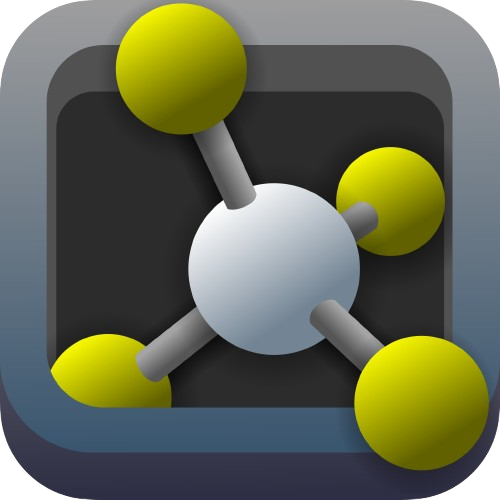
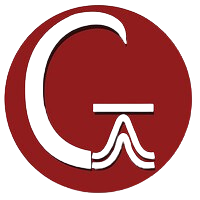
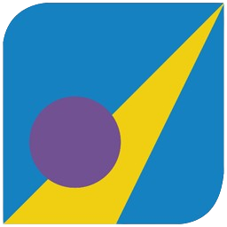
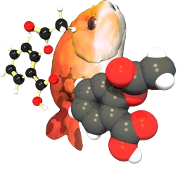
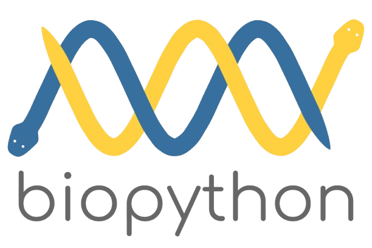
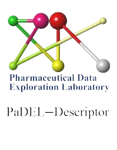
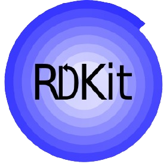
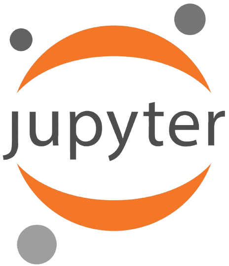
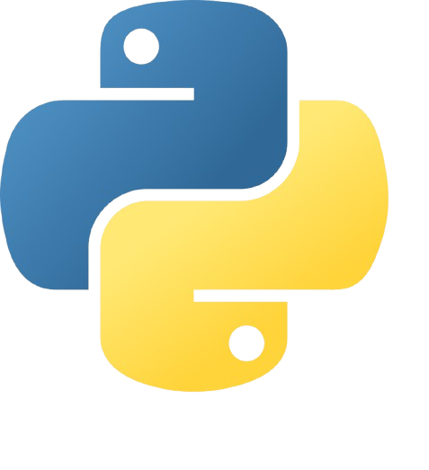
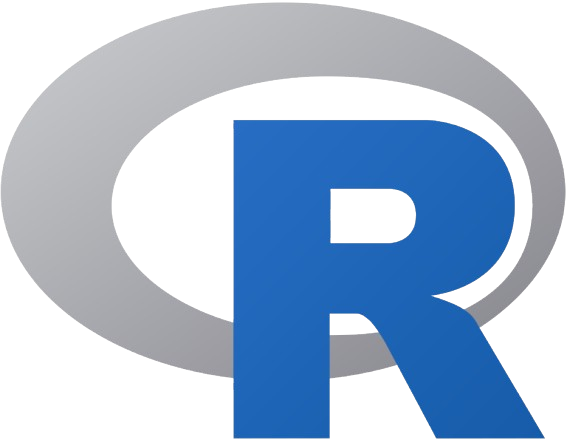

<h1 align="center">Hi 👋, I'm Daniel </h1>

I'm a Chemistry Student Passionate About Computational Chemistry 🚀

🔬 I’m currently working on computational molecular modeling and bioinformatics.

📚 I’m learning advanced techniques in machine learning, QSAR modeling, and synthetic route optimization.

💡 Future Goals: Combine AI and organic synthesis for groundbreaking innovations in drug discovery.

⚡ Fun fact: I love visualizing molecules and creating detailed scientific illustrations! 🎨

## Lab Vibes 🎧

 About Me ....

✔ Call me: He/His or Lab Enthusiast 😊  
✔ I’m currently working on QSAR modeling, molecular docking, and organic synthesis optimization 🔬 
✔ I’m currently learning advanced machine learning techniques and their applications in drug discovery 🧠 
✔ A contributor to open scientific projects. Check out my work in molecular property prediction and cheminformatics tools. 
✔ Passionate about combining AI and chemistry to solve complex scientific problems 🤖 
✔ Always excited to collaborate on computational chemistry or bioinformatics projects! 
✔ Fun fact: I often visualize molecules before bed—my dreams are molecular structures 😎    

## Tech Stack ⚗️  

<table>
  <tr>
    <th>Category</th>
    <th>Tools</th>
  </tr>
  <tr>
    <td align="center"><b>Computational Chemistry</b></td>
    <td align="center">
        
        
        
        
        
        
      
PyMOL, Avogadro, Gaussian, MOE, VMD, Open Babel

    </td>
  </tr>
  <tr>
    <td align="center"><b>Bioinformatics</b></td>
    <td align="center">
        
        
        
        
        
      
Biopython, Pandas, PaDEL-Descriptor, RDKit, Jupyter Notebook

    </td>
  </tr>
  <tr>
    <td align="center"><b>Programming Languages</b></td>
    <td align="center">
        
        
      
Python, R

    </td>
  </tr>
</table>

### Tech Stack 💻  
  
  
  

### Let's Connect 🌐  
- 📫 [Email](mailto:tu-email@example.com)  
- 💼 [LinkedIn](https://www.linkedin.com/in/tu-perfil)  
- 🧪 [ResearchGate](https://www.researchgate.net/profile/tu-perfil)  
