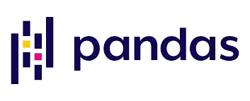

<h1 align="center">Hi 👋, I'm Daniel </h1>

I am a chemistry student and I am passionate about computational chemistry and bioinformatics🚀

🔬 I am currently pursuing my undergraduate degree in Chemistry

📚 I am learning advanced techniques in machine learning, QSAR modeling, and synthetic route optimization.

💡 Future goals: See how good I can be.

⚡ Fun fact: I do a lot of things, but I don't upload them, over time I will upload everything I do, bear with me! 🎨

### Lab Vibes 🎧

  

  

###  About Me...

✔ Call me: He/His or Lab Enthusiast 😊  
✔ I’m currently working on QSAR modeling, molecular docking, and organic synthesis optimization 🔬 
✔ I’m currently learning advanced machine learning techniques and their applications in drug discovery 🧠 
✔ A contributor to open scientific projects. Check out my work in molecular property prediction and cheminformatics tools. 
✔ Passionate about combining AI and chemistry to solve complex scientific problems 🤖 
✔ Always excited to collaborate on computational chemistry or bioinformatics projects! 
✔ Fun fact: I often visualize molecules before bed—my dreams are molecular structures 😠   

  

  
## Tech Stack ⚗️  

<table>
  <tr>
    <th>Category</th>
    <th>Tools</th>
  </tr>
  <tr>
    <td align="center"><b>Computational Chemistry</b></td>
    <td align="center">
        
        
        
        
        
        
    </td>
  </tr>
  <tr>
    <td align="center"><b>Bioinformatics</b></td>
    <td align="center">
        
        
        
        
        
    </td>
  </tr>
  <tr>
    <td align="center"><b>Programming Languages</b></td>
    <td align="center">
        
        
    </td>
  </tr>
</table>

<h2>Github stats:</h2> 

  

    

  

 

  
  

    <ul align="left">
      
<h2 style="display: inline-block">How to reach me🤝</h2>

    </ul>
    
  

  <!--icons and links-->
  

  
  
  
  

  

